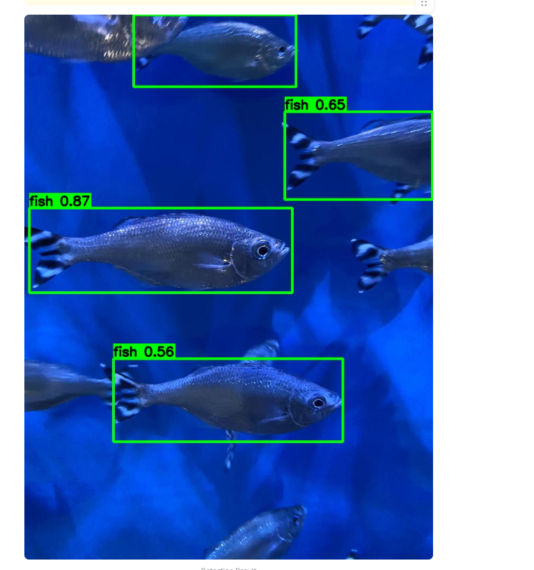

<!-- Image preview at the top -->

# Underwater-Object-Detection
This project demonstrates underwater object detection using the YOLOv8 deep learning model. It includes a user-friendly web interface built with Streamlit that allows users to upload images and view detected marine species with bounding boxes.

